# Демонстрация работы

## Запуск проекта

Для запуска приложения используется команда:

```bash
uvicorn app.main:app --reload
```

После запуска Swagger UI доступен по адресу:

```text
http://127.0.0.1:8000/docs
```

---

## Что необходимо показать

### 1. Структура проекта

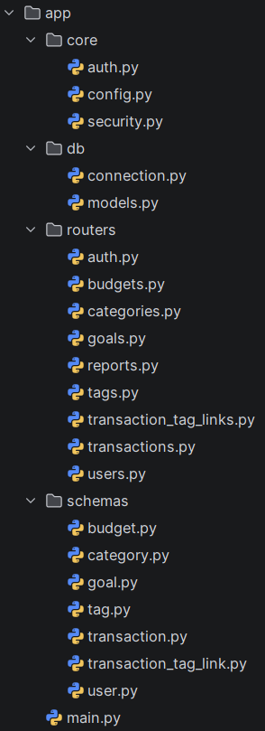

---

### 2. Регистрация и авторизация пользователя
Регистрация
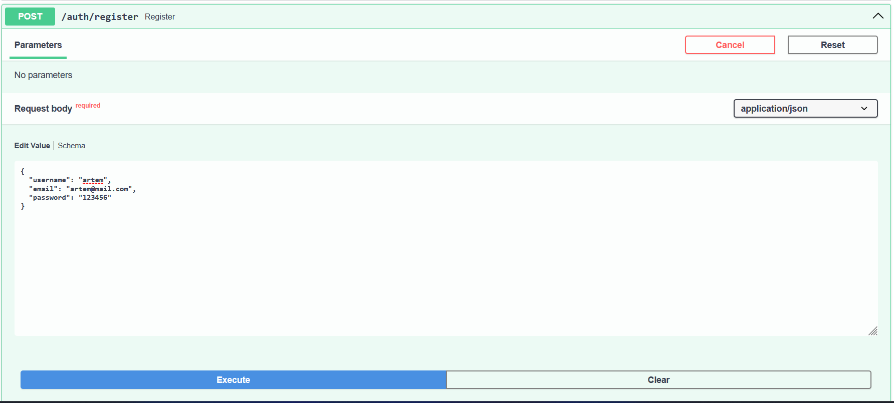
Запись появилась в таблице
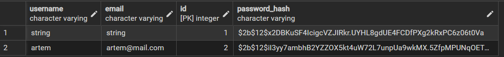
Авторизация
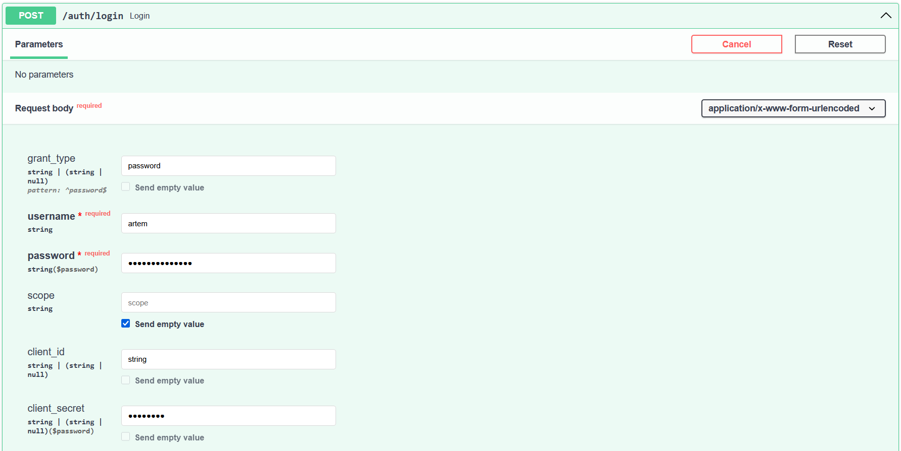
---

### 3. Авторизация в Swagger

Нажимаем кнопку `Authorize`

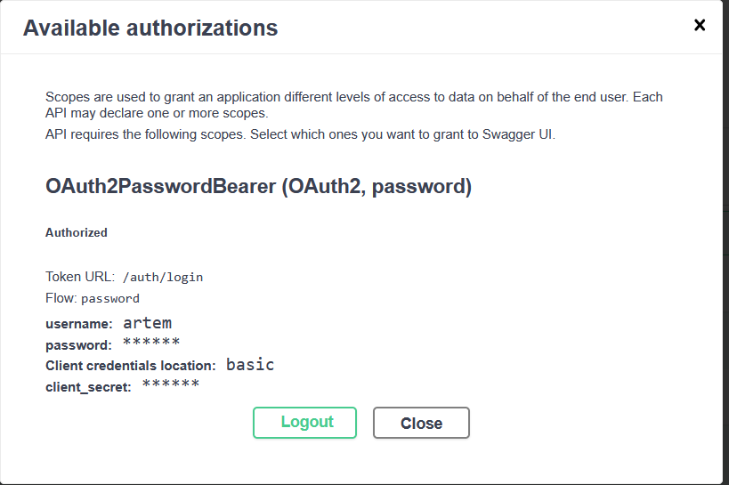

---

### 4. Получение текущего пользователя

GET /auth/me
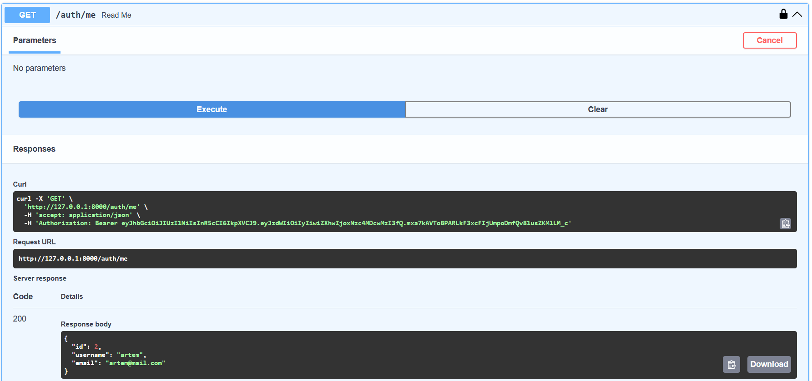

---

### 5. Создание категории

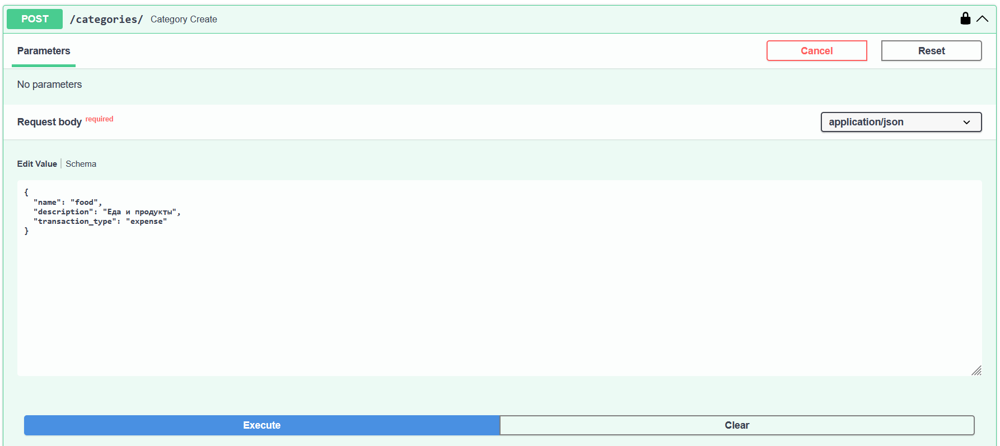

### 6. Создание тега

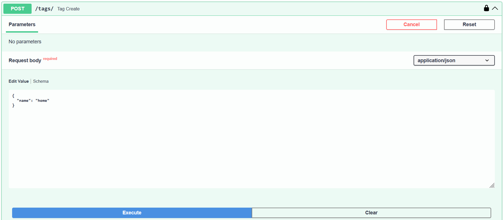

---

### 7. Создание транзакции


---

### 8. Привязка тега к транзакции

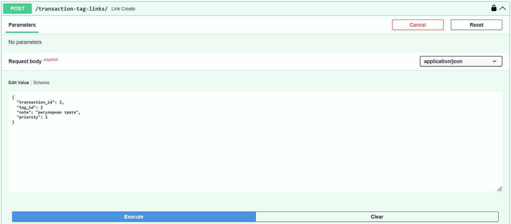

---

### 9. Получение транзакции с вложенными объектами

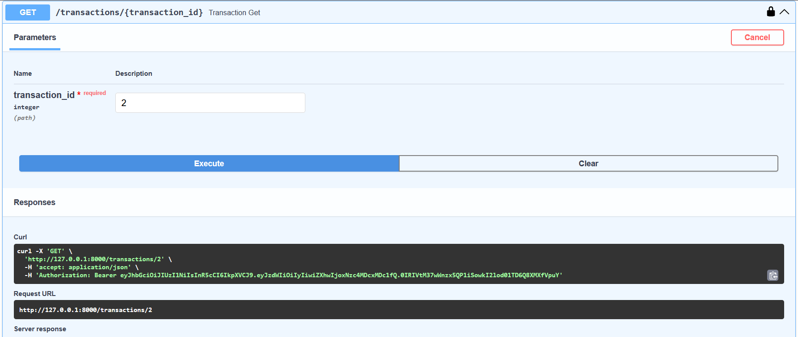

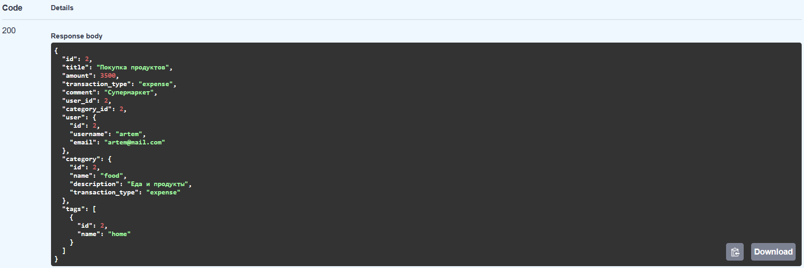

Это подтверждает работу связей one-to-many и many-to-many.

---

### 12. Создание бюджета


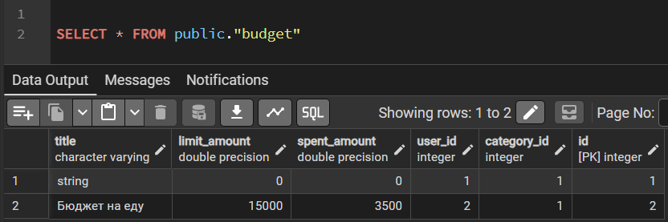

---

### 13. Проверка статуса бюджета

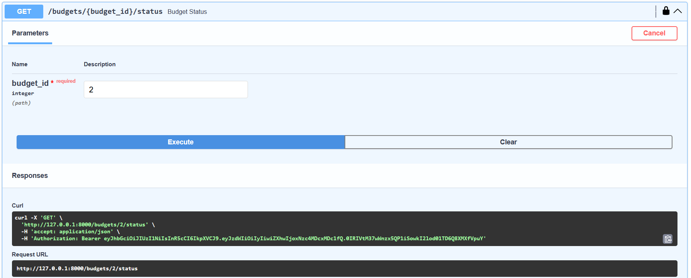

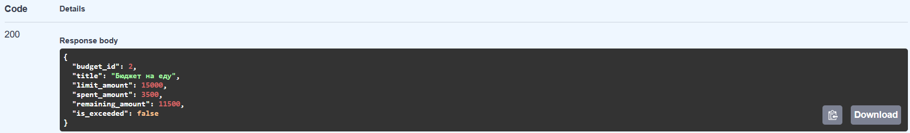

---

### 14. Создание финансовой цели

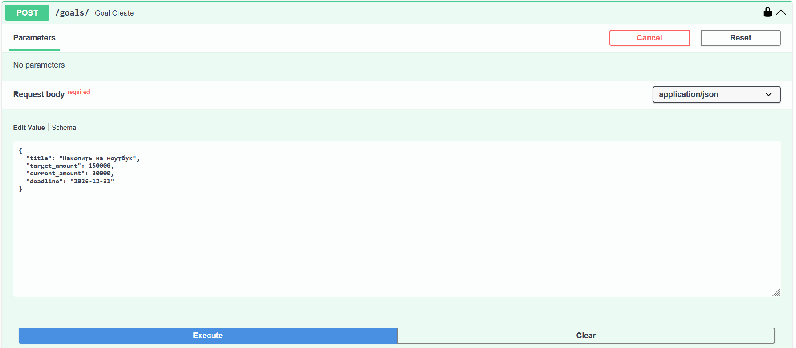

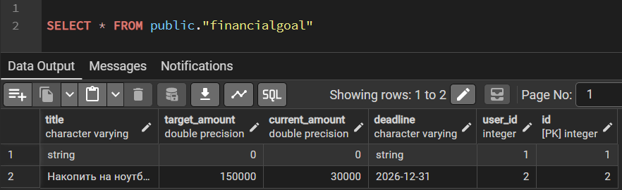

---

### 15. Финансовый отчет

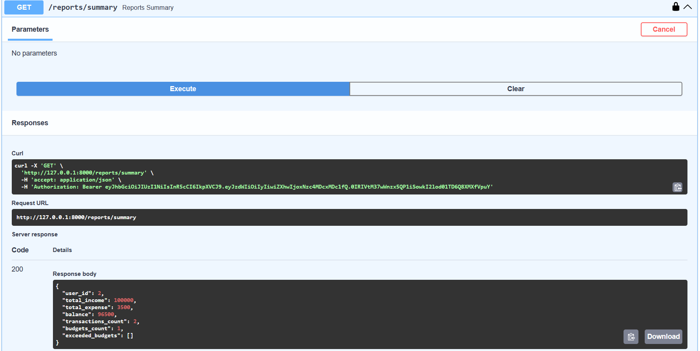

---

## Итог демонстрации

В результате демонстрации подтверждается, что приложение:

- подключено к PostgreSQL;
- использует ORM SQLModel;
- имеет разделенную файловую структуру;
- поддерживает регистрацию и авторизацию;
- генерирует JWT-токены;
- защищает API через Bearer Token;
- хэширует пароли;
- реализует CRUD для основных сущностей;
- поддерживает one-to-many и many-to-many связи;
- возвращает вложенные объекты;
- формирует финансовый отчет.