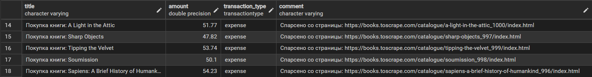

# Задача 2. Параллельный парсинг веб-страниц

## Постановка задачи

Необходимо реализовать три программы для параллельного парсинга веб-страниц с использованием разных подходов:

* `threading`;
* `multiprocessing`;
* `asyncio`.

Каждая программа должна загружать HTML-страницу по указанному URL, извлекать данные со страницы, сохранять результат в базу данных PostgreSQL и выводить информацию о выполненной операции.

В качестве источника данных использовался сайт `books.toscrape.com`, предназначенный для учебного парсинга. Из страниц книг извлекались название и цена, после чего результат сохранялся в таблицу транзакций как покупка книги.

---

## Общая логика парсинга

Во всех трёх вариантах используется одинаковая логика обработки одной страницы:

```python
def parse_book(url: str) -> tuple[str, float]:
    response = requests.get(url)
    soup = BeautifulSoup(response.text, "html.parser")

    title = soup.find("h1").get_text(strip=True)
    price_text = soup.find("p", class_="price_color").get_text(strip=True)

    price = float(
        price_text
        .replace("£", "")
        .replace("Â", "")
        .strip()
    )

    return title, price
```

После получения данных результат сохраняется в базу данных:

```python
def save_to_db(title: str, price: float, url: str, approach: str) -> None:
    cursor.execute(
        """
        INSERT INTO transaction
        (title, amount, transaction_type, comment, user_id, category_id)
        VALUES (%s, %s, %s, %s, %s, %s)
        """,
        (
            f"Покупка книги: {title}",
            price,
            "expense",
            f"Спарсено со страницы: {url}",
            2,
            2
        )
    )
```

Для тестирования использовались заранее выбранные страницы книг. Один URL соответствует одной задаче парсинга.

---

## Threading

В реализации через `threading` для каждого URL создаётся отдельный поток. Потоки выполняются в рамках одного процесса и позволяют параллельно ожидать ответы от сайтов.

```python
def parse_and_save(url: str) -> None:
    title, price = parse_book(url)
    save_to_db(title, price, url, "threading")

    print(f"[threading] Покупка книги: {title} — {price}")


threads = []

for url in URLS:
    thread = threading.Thread(target=parse_and_save, args=(url,))
    threads.append(thread)
    thread.start()

for thread in threads:
    thread.join()
```

Подход `threading` хорошо подходит для I/O-bound задач, так как основное время при парсинге тратится на ожидание ответа от сайта.

---

## Multiprocessing

В реализации через `multiprocessing` используется пул процессов. Каждый процесс независимо обрабатывает отдельный URL.

```python
def parse_and_save(url: str) -> None:
    title, price = parse_book(url)
    save_to_db(title, price, url, "multiprocessing")

    print(f"[multiprocessing] Покупка книги: {title} — {price}")


with multiprocessing.Pool(processes=multiprocessing.cpu_count()) as pool:
    pool.map(parse_and_save, URLS)
```

Такой подход позволяет выполнять задачи в отдельных процессах. Для парсинга это не всегда даёт лучший результат, потому что создание процессов имеет дополнительные накладные расходы.

---

## Asyncio

В реализации через `asyncio` HTTP-запросы выполняются асинхронно. Для загрузки страниц используется `aiohttp`, а несколько задач запускаются одновременно через `asyncio.gather()`.

```python
async def parse_and_save(session: aiohttp.ClientSession, url: str) -> None:
    async with session.get(url) as response:
        html = await response.text()

    soup = BeautifulSoup(html, "html.parser")

    title = soup.find("h1").get_text(strip=True)
    price_text = soup.find("p", class_="price_color").get_text(strip=True)

    price = float(
        price_text
        .replace("£", "")
        .replace("Â", "")
        .strip()
    )

    save_to_db(title, price, url, "async")

    print(f"[async] Покупка книги: {title} — {price}")


async with aiohttp.ClientSession() as session:
    tasks = [
        parse_and_save(session, url)
        for url in URLS
    ]

    await asyncio.gather(*tasks)
```

Асинхронный подход особенно хорошо подходит для сетевых операций, так как позволяет не блокировать выполнение программы во время ожидания ответа от сервера.

---

### Данные появились в таблице



---

## Результаты тестирования

Для каждого подхода был выполнен парсинг одинакового набора страниц с последующим сохранением данных в базу PostgreSQL.

| Подход          | Время выполнения |
| --------------- | ---------------: |
| Threading       |        0.953 сек |
| Multiprocessing |        1.834 сек |
| Asyncio         |        0.633 сек |

---

## Вывод

Результаты отличаются от первой задачи, поскольку основное время при парсинге тратится не на вычисления, а на ожидание ответа от веб-сервера.

Наилучший результат показал подход `asyncio`. Асинхронные запросы позволяют эффективно использовать время ожидания сетевого ответа и выполнять несколько операций одновременно без создания дополнительных потоков и процессов.

Подход `threading` также продемонстрировал хорошие результаты. Во время ожидания ответа от сервера потоки могут переключаться между задачами, поэтому ограничение GIL практически не влияет на производительность в данном сценарии.

Наиболее медленным оказался `multiprocessing`. Несмотря на возможность реального параллельного выполнения, создание отдельных процессов и организация межпроцессного взаимодействия создают дополнительные накладные расходы, которые оказываются больше потенциальной выгоды при небольшом количестве сетевых запросов.

