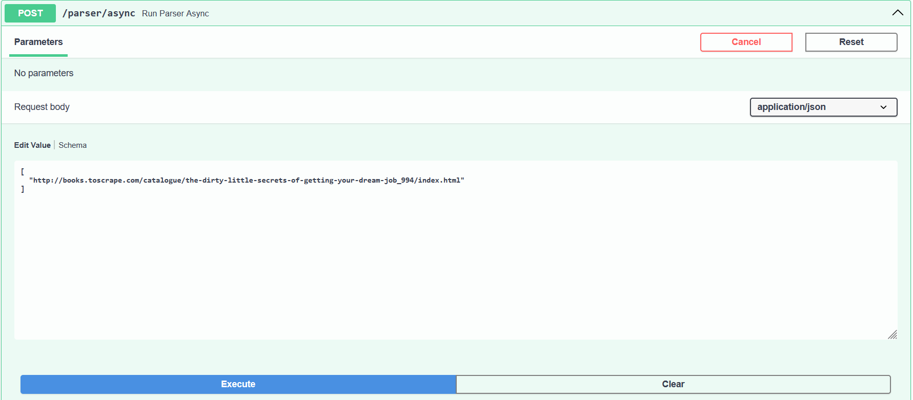
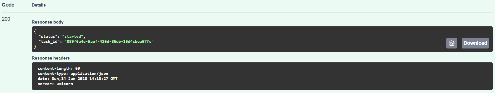
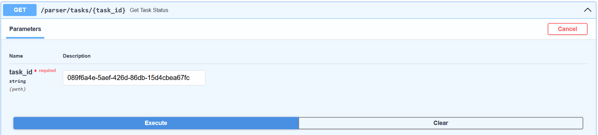
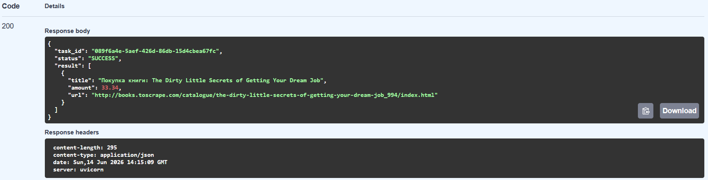

# Celery и Redis

В данной части реализован асинхронный вызов парсера.

Основное приложение не ждёт завершения парсинга, а ставит задачу в очередь Redis. После этого Celery worker забирает задачу из очереди и выполняет её в фоне.

---

## Настройка Celery

Файл `celery_app.py` содержит конфигурацию Celery.

```python
REDIS_URL = os.getenv("REDIS_URL", "redis://redis:6379/0")

celery_app = Celery(
    "finance_parser",
    broker=REDIS_URL,
    backend=REDIS_URL,
)

celery_app.autodiscover_tasks(["app.parser"])
```

Redis используется одновременно как брокер задач и как backend для хранения результатов.

---

## Celery-задача

Файл `tasks.py` содержит задачу для фонового запуска парсера.

```python
@celery_app.task(name="parse_books_task")
def parse_books_task(urls: list[str] | None = None):
    return parse_urls(urls)
```

Эта задача вызывает ту же функцию парсинга, что и синхронный сервис, но выполняется в отдельном контейнере `finance_worker`.

---

## Асинхронный endpoint

В основном приложении был добавлен endpoint `/parser/async`.

```python
@router.post("/async")
def run_parser_async(urls: list[str] | None = None):
    task = parse_books_task.delay(urls)

    return {
        "status": "started",
        "task_id": task.id,
    }
```

После вызова endpoint сразу возвращает `task_id`, не ожидая завершения парсинга.

---

## Проверка статуса задачи

Для проверки результата используется endpoint `/parser/tasks/{task_id}`.

```python
@router.get("/tasks/{task_id}")
def get_task_status(task_id: str):
    task = AsyncResult(task_id, app=celery_app)

    return {
        "task_id": task_id,
        "status": task.status,
        "result": task.result if task.ready() else None,
    }
```

Если задача успешно выполнена, статус становится:

```text
SUCCESS
```

---

## Проверка через Swagger

Для запуска фоновой задачи используется:`POST /parser/async`


Получаем `task_id`


После получения `task_id` необходимо выполнить `GET /parser/tasks/{task_id}`



Убеждаемся, что статус SUCCESS

