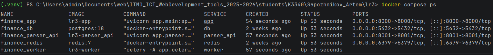
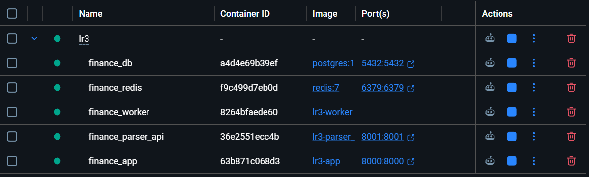

# Docker и Docker Compose


В данной части лабораторной работы приложение упаковывается в Docker-контейнеры. Это позволяет запускать FastAPI-приложение, PostgreSQL, Redis, Celery worker и отдельный сервис парсера одной командой.

---

## Dockerfile

Для сборки образа приложения используется `Dockerfile`.

```dockerfile
FROM python:3.12-slim

WORKDIR /app

COPY requirements.txt .

RUN pip install --no-cache-dir -r requirements.txt

COPY . .

CMD ["uvicorn", "app.main:app", "--host", "0.0.0.0", "--port", "8000"]
```

В этом файле:

* используется базовый образ Python;
* создаётся рабочая директория `/app`;
* устанавливаются зависимости из `requirements.txt`;
* копируется исходный код проекта;
* запускается FastAPI-приложение через `uvicorn`.

---

## Docker Compose

Для управления несколькими контейнерами используется `docker-compose.yml`.

Основные сервисы:

```yaml
services:
  db:
    image: postgres:18
    container_name: finance_db
    environment:
      POSTGRES_USER: postgres
      POSTGRES_PASSWORD: ***
      POSTGRES_DB: finance_final_db
    ports:
      - "5432:5432"
    volumes:
      - postgres_data:/var/lib/postgresql

  redis:
    image: redis:7
    container_name: finance_redis
    ports:
      - "6379:6379"
```

В этой части описываются PostgreSQL и Redis. PostgreSQL используется для хранения данных приложения, а Redis — как брокер сообщений для Celery.

---

## Сервисы приложения

```yaml
  parser_api:
    build: .
    container_name: finance_parser_api
    command: uvicorn app.parser.parser_api:app --host 0.0.0.0 --port 8001
    ports:
      - "8001:8001"
    depends_on:
      - db

  app:
    build: .
    container_name: finance_app
    ports:
      - "8000:8000"
    environment:
      DB_HOST: db
      DB_NAME: finance_final_db
      REDIS_URL: redis://redis:6379/0
      PARSER_API_URL: http://parser_api:8001
    depends_on:
      - db
      - redis
      - parser_api

  worker:
    build: .
    container_name: finance_worker
    command: celery -A app.celery_app.celery_app worker --loglevel=info
    environment:
      DB_HOST: db
      DB_NAME: finance_final_db
      REDIS_URL: redis://redis:6379/0
    depends_on:
      - db
      - redis
```

Здесь описываются:

* `parser_api` — отдельный HTTP-сервис парсера;
* `app` — основное FastAPI-приложение;
* `worker` — Celery worker для фоновой обработки задач.

---

## Запуск проекта

Запуск выполняется с помощью команды:

```powershell
docker compose up --build
```

Проверим состояния контейнеров:

```powershell
docker compose ps
```

В веб версии докера, также все контейнеры включены

