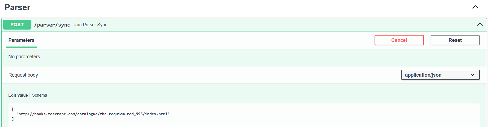

# HTTP-интеграция парсера

В данной части реализуется синхронный вызов парсера из основного FastAPI-приложения.

Парсер вынесен в отдельный контейнер `finance_parser_api`, а основное приложение обращается к нему по HTTP.

---

## Сервис парсера

Файл `parser_api.py` содержит отдельное FastAPI-приложение для парсера.

```python
app = FastAPI(title="Parser API")


class ParseRequest(BaseModel):
    urls: list[str] | None = None


@app.post("/parse")
def parse(request: ParseRequest):
    result = parse_urls(request.urls)
    return {
        "status": "completed",
        "items": result
    }
```

Endpoint `/parse` принимает список URL-адресов. Если список не передан, используется заранее заданный список тестовых страниц.

---

## Вызов парсера из основного FastAPI-приложения

В основном приложении был добавлен endpoint `/parser/sync`.

```python
@router.post("/sync")
def run_parser_sync(urls: list[str] | None = None):
    response = requests.post(
        f"{PARSER_API_URL}/parse",
        json={"urls": urls},
        timeout=30
    )

    response.raise_for_status()
    return response.json()
```

Основное приложение не выполняет парсинг напрямую. Оно отправляет HTTP-запрос в сервис `parser_api`, который работает в отдельном контейнере.

---

## Логика парсинга

Парсер получает страницу книги, извлекает название и цену, после чего сохраняет результат в базу данных.

```python
def parse_one_url(url: str) -> dict:
    response = requests.get(
        url,
        timeout=30,
        headers={"User-Agent": "Mozilla/5.0"}
    )

    soup = BeautifulSoup(response.text, "html.parser")

    book_title = soup.find("h1").get_text(strip=True)
    price_text = soup.find("p", class_="price_color").get_text(strip=True)

    title = f"Покупка книги: {book_title}"
    amount = parse_price(price_text)
    comment = f"Спарсено со страницы: {url}"

    save_transaction(title, amount, comment)

    return {
        "title": title,
        "amount": amount,
        "url": url,
    }
```

---

## Проверка через Swagger

Для проверки используется endpoint `POST /parser/sync`:




```powerShell
(.venv) PS C:\Users\admin\Documents\web\ITMO_ICT_WebDevelopment_tools_2025-2026\students\K3340\Sapozhnikov_Artem\lr3> docker exec -it finance_db psql -U postgres -d finance_final_db
psql (18.4 (Debian 18.4-1.pgdg13+1))
Type "help" for help.

finance_final_db=# SELECT id, title, amount, comment
FROM transaction
WHERE title ILIKE '%Requiem%'
ORDER BY id DESC;
 id |             title              | amount |                                         comment                                          
----+--------------------------------+--------+------------------------------------------------------------------------------------------
 65 | Покупка книги: The Requiem Red |  22.65 | Спарсено со страницы: http://books.toscrape.com/catalogue/the-requiem-red_995/index.html
```

Запись о книге появилась!
