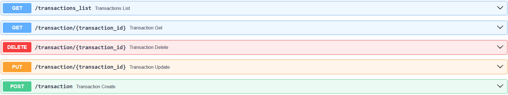
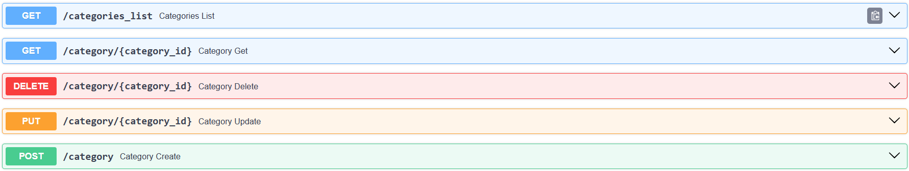

# Практика 1.1

## Цель работы

Изучение основ FastAPI и реализация простого REST API.

---

## Реализованные модели

```python
class Category(BaseModel):
    id: int
    name: str
    description: str
    transaction_type: TransactionType

class Transaction(BaseModel):
    id: int
    title: str
    amount: float
    transaction_type: TransactionType
    comment: Optional[str] = ""
    category: Category
    user: User
    tags: Optional[List[Tag]] = []
```

## Реализованные методы API

### Transactions
```python
@app.get("/transactions_list")
def transactions_list() -> List[Transaction]:
    return transactions_bd


@app.get("/transaction/{transaction_id}")
def transaction_get(transaction_id: int) -> List[Transaction]:
    return [transaction for transaction in transactions_bd if transaction.get("id") == transaction_id]


@app.post("/transaction")
def transaction_create(transaction: Transaction):
    transactions_bd.append(transaction.model_dump())
    return {"status": 200, "data": transaction}


@app.delete("/transaction/{transaction_id}")
def transaction_delete(transaction_id: int):
    for i, transaction in enumerate(transactions_bd):
        if transaction.get("id") == transaction_id:
            transactions_bd.pop(i)
            break
    return {"status": 200, "message": "deleted"}


@app.put("/transaction/{transaction_id}")
def transaction_update(transaction_id: int, transaction: Transaction) -> List[Transaction]:
    for i, tr in enumerate(transactions_bd):
        if tr.get("id") == transaction_id:
            transactions_bd[i] = transaction.model_dump()
            break
    return transactions_bd
```


### Categories

```python
@app.get("/categories_list")
def categories_list() -> List[Category]:
    return categories_bd


@app.get("/category/{category_id}")
def category_get(category_id: int) -> List[Category]:
    return [category for category in categories_bd if category.get("id") == category_id]


@app.post("/category")
def category_create(category: Category):
    categories_bd.append(category.model_dump())
    return {"status": 200, "data": category}


@app.delete("/category/{category_id}")
def category_delete(category_id: int):
    for i, category in enumerate(categories_bd):
        if category.get("id") == category_id:
            categories_bd.pop(i)
            break
    return {"status": 200, "message": "deleted"}


@app.put("/category/{category_id}")
def category_update(category_id: int, category: Category) -> List[Category]:
    for i, cat in enumerate(categories_bd):
        if cat.get("id") == category_id:
            categories_bd[i] = category.model_dump()
            break
    return categories_bd
```

