# Практика 1.2

## Цель работы

Изучение ORM SQLModel и подключение FastAPI-приложения к PostgreSQL.

---

## Подключение к базе данных

```python
import os
from dotenv import load_dotenv

from sqlmodel import SQLModel, Session, create_engine

load_dotenv()

db_url = os.getenv("DB_ADMIN")
engine = create_engine(db_url, echo=True)


def init_db():
    SQLModel.metadata.create_all(engine)


def get_session():
    with Session(engine) as session:
        yield session
```

---

## Реализованные модели

### One-to-many связи

```python
class User(UserBase, table=True):
    id: Optional[int] = Field(default=None, primary_key=True)
    transactions: List["Transaction"] = Relationship(back_populates="user")


class Category(CategoryBase, table=True):
    id: Optional[int] = Field(default=None, primary_key=True)
    transactions: List["Transaction"] = Relationship(back_populates="category")


class Transaction(TransactionBase, table=True):
    id: Optional[int] = Field(default=None, primary_key=True)
    user: Optional[User] = Relationship(back_populates="transactions")
    category: Optional[Category] = Relationship(back_populates="transactions")
```

### Many-to-many связь

```python
class TransactionTagLink(SQLModel, table=True):
    transaction_id: Optional[int] = Field(
        default=None, foreign_key="transaction.id", primary_key=True
    )
    tag_id: Optional[int] = Field(
        default=None, foreign_key="tag.id", primary_key=True
    )
    note: Optional[str] = None


class Tag(TagBase, table=True):
    id: Optional[int] = Field(default=None, primary_key=True)
    transactions: List["Transaction"] = Relationship(
        back_populates="tags",
        link_model=TransactionTagLink
    )


class Transaction(TransactionBase, table=True):
    id: Optional[int] = Field(default=None, primary_key=True)
    user: Optional[User] = Relationship(back_populates="transactions")
    category: Optional[Category] = Relationship(back_populates="transactions")
    tags: List[Tag] = Relationship(
        back_populates="transactions",
        link_model=TransactionTagLink
    )
```

---

## Вложенное отображение данных

Для отображения связанных объектов используется отдельная модель ответа.

```python
class TransactionRead(TransactionBase):
    id: int


class TransactionReadWithRelations(TransactionRead):
    user: Optional[UserBase] = None
    category: Optional[CategoryBase] = None
    tags: List[TagBase] = []
```

```python
@app.get("/transaction/{transaction_id}", response_model=TransactionReadWithRelations)
def transaction_get(transaction_id: int, session: Session = Depends(get_session)) -> Transaction:
    transaction = session.get(Transaction, transaction_id)
    if not transaction:
        raise HTTPException(status_code=404, detail="Transaction not found")
    return transaction
```

---

## Реализованные методы API

### Users

```python
@app.get("/users_list")
def users_list(session: Session = Depends(get_session)) -> List[User]:
    return session.exec(select(User)).all()


@app.get("/user/{user_id}")
def user_get(user_id: int, session: Session = Depends(get_session)) -> User:
    user = session.get(User, user_id)
    if not user:
        raise HTTPException(status_code=404, detail="User not found")
    return user


@app.post("/user")
def user_create(user: UserBase, session: Session = Depends(get_session)):
    db_user = User.model_validate(user)
    session.add(db_user)
    session.commit()
    session.refresh(db_user)
    return {"status": 200, "data": db_user}


@app.patch("/user/{user_id}")
def user_update(user_id: int, user: UserBase, session: Session = Depends(get_session)) -> User:
    db_user = session.get(User, user_id)
    if not db_user:
        raise HTTPException(status_code=404, detail="User not found")

    user_data = user.model_dump(exclude_unset=True)
    for key, value in user_data.items():
        setattr(db_user, key, value)

    session.add(db_user)
    session.commit()
    session.refresh(db_user)
    return db_user


@app.delete("/user/{user_id}")
def user_delete(user_id: int, session: Session = Depends(get_session)):
    user = session.get(User, user_id)
    if not user:
        raise HTTPException(status_code=404, detail="User not found")
    session.delete(user)
    session.commit()
    return {"ok": True}
```

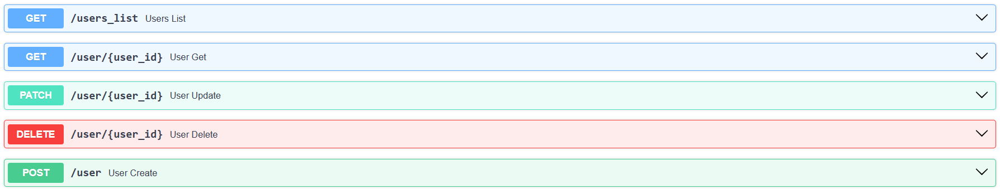

### Categories

```python
@app.get("/categories_list")
def categories_list(session: Session = Depends(get_session)) -> List[Category]:
    return session.exec(select(Category)).all()


@app.get("/category/{category_id}")
def category_get(category_id: int, session: Session = Depends(get_session)) -> Category:
    category = session.get(Category, category_id)
    if not category:
        raise HTTPException(status_code=404, detail="Category not found")
    return category


@app.post("/category")
def category_create(category: CategoryBase, session: Session = Depends(get_session)):
    db_category = Category.model_validate(category)
    session.add(db_category)
    session.commit()
    session.refresh(db_category)
    return {"status": 200, "data": db_category}


@app.patch("/category/{category_id}")
def category_update(category_id: int, category: CategoryBase, session: Session = Depends(get_session)) -> Category:
    db_category = session.get(Category, category_id)
    if not db_category:
        raise HTTPException(status_code=404, detail="Category not found")

    category_data = category.model_dump(exclude_unset=True)
    for key, value in category_data.items():
        setattr(db_category, key, value)

    session.add(db_category)
    session.commit()
    session.refresh(db_category)
    return db_category


@app.delete("/category/{category_id}")
def category_delete(category_id: int, session: Session = Depends(get_session)):
    category = session.get(Category, category_id)
    if not category:
        raise HTTPException(status_code=404, detail="Category not found")
    session.delete(category)
    session.commit()
    return {"ok": True}
```

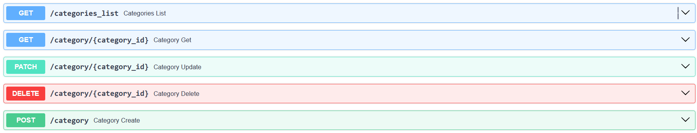

### Tags

```python
@app.get("/tags_list")
def tags_list(session: Session = Depends(get_session)) -> List[Tag]:
    return session.exec(select(Tag)).all()


@app.get("/tag/{tag_id}")
def tag_get(tag_id: int, session: Session = Depends(get_session)) -> Tag:
    tag = session.get(Tag, tag_id)
    if not tag:
        raise HTTPException(status_code=404, detail="Tag not found")
    return tag


@app.post("/tag")
def tag_create(tag: TagBase, session: Session = Depends(get_session)):
    db_tag = Tag.model_validate(tag)
    session.add(db_tag)
    session.commit()
    session.refresh(db_tag)
    return {"status": 200, "data": db_tag}


@app.patch("/tag/{tag_id}")
def tag_update(tag_id: int, tag: TagBase, session: Session = Depends(get_session)) -> Tag:
    db_tag = session.get(Tag, tag_id)
    if not db_tag:
        raise HTTPException(status_code=404, detail="Tag not found")

    tag_data = tag.model_dump(exclude_unset=True)
    for key, value in tag_data.items():
        setattr(db_tag, key, value)

    session.add(db_tag)
    session.commit()
    session.refresh(db_tag)
    return db_tag


@app.delete("/tag/{tag_id}")
def tag_delete(tag_id: int, session: Session = Depends(get_session)):
    tag = session.get(Tag, tag_id)
    if not tag:
        raise HTTPException(status_code=404, detail="Tag not found")
    session.delete(tag)
    session.commit()
    return {"ok": True}
```

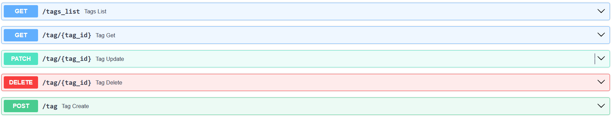

### Transactions

```python
@app.get("/transactions_list")
def transactions_list(session: Session = Depends(get_session)) -> List[Transaction]:
    return session.exec(select(Transaction)).all()


@app.get("/transaction/{transaction_id}", response_model=TransactionReadWithRelations)
def transaction_get(transaction_id: int, session: Session = Depends(get_session)) -> Transaction:
    transaction = session.get(Transaction, transaction_id)
    if not transaction:
        raise HTTPException(status_code=404, detail="Transaction not found")
    return transaction


@app.post("/transaction")
def transaction_create(transaction: TransactionBase, session: Session = Depends(get_session)):
    db_transaction = Transaction.model_validate(transaction)
    session.add(db_transaction)
    session.commit()
    session.refresh(db_transaction)
    return {"status": 200, "data": db_transaction}


@app.patch("/transaction/{transaction_id}")
def transaction_update(
    transaction_id: int,
    transaction: TransactionBase,
    session: Session = Depends(get_session)
) -> Transaction:
    db_transaction = session.get(Transaction, transaction_id)
    if not db_transaction:
        raise HTTPException(status_code=404, detail="Transaction not found")

    transaction_data = transaction.model_dump(exclude_unset=True)
    for key, value in transaction_data.items():
        setattr(db_transaction, key, value)

    session.add(db_transaction)
    session.commit()
    session.refresh(db_transaction)
    return db_transaction


@app.delete("/transaction/{transaction_id}")
def transaction_delete(transaction_id: int, session: Session = Depends(get_session)):
    transaction = session.get(Transaction, transaction_id)
    if not transaction:
        raise HTTPException(status_code=404, detail="Transaction not found")
    session.delete(transaction)
    session.commit()
    return {"ok": True}
```


---

## API для many-to-many связи

Для связи транзакций и тегов используется ассоциативная таблица `TransactionTagLink`.

```python
@app.post("/transaction_tag_link")
def add_tag_to_transaction(link_data: TagLinkCreate, session: Session = Depends(get_session)):
    transaction = session.get(Transaction, link_data.transaction_id)
    tag = session.get(Tag, link_data.tag_id)

    if not transaction:
        raise HTTPException(status_code=404, detail="Transaction not found")
    if not tag:
        raise HTTPException(status_code=404, detail="Tag not found")

    link = TransactionTagLink(
        transaction_id=link_data.transaction_id,
        tag_id=link_data.tag_id,
        note=link_data.note
    )

    session.add(link)
    session.commit()
    return {"status": 200, "message": "Tag linked to transaction"}


@app.get("/transaction_tag_links")
def transaction_tag_links_list(session: Session = Depends(get_session)) -> List[TransactionTagLink]:
    return session.exec(select(TransactionTagLink)).all()
```

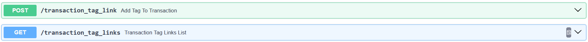

---

## Итоговая база данных

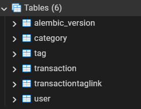

---

## Пример добавления транзакции
Создаём пользователя
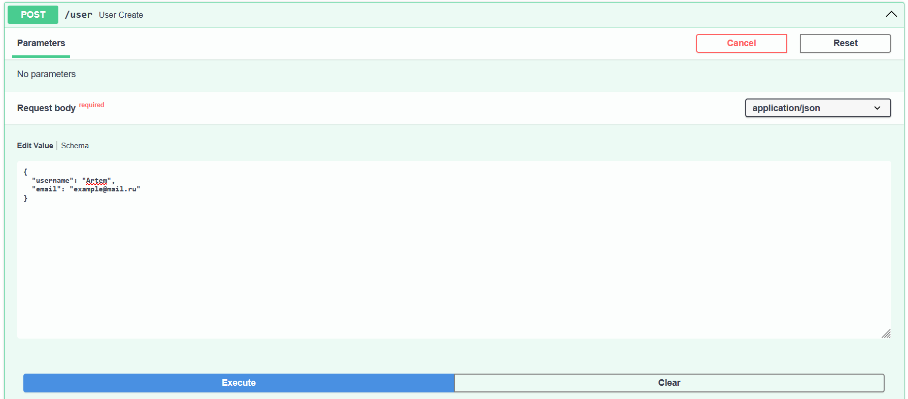
Создаём категорию
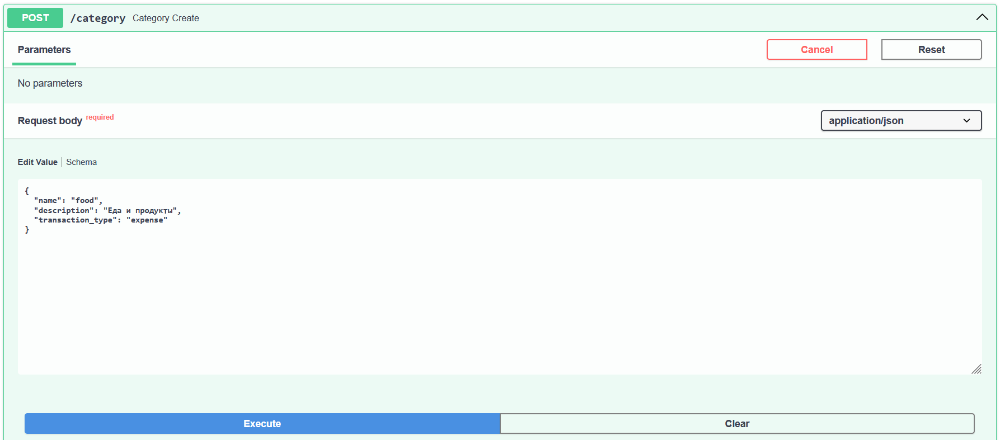
Создаём тэг
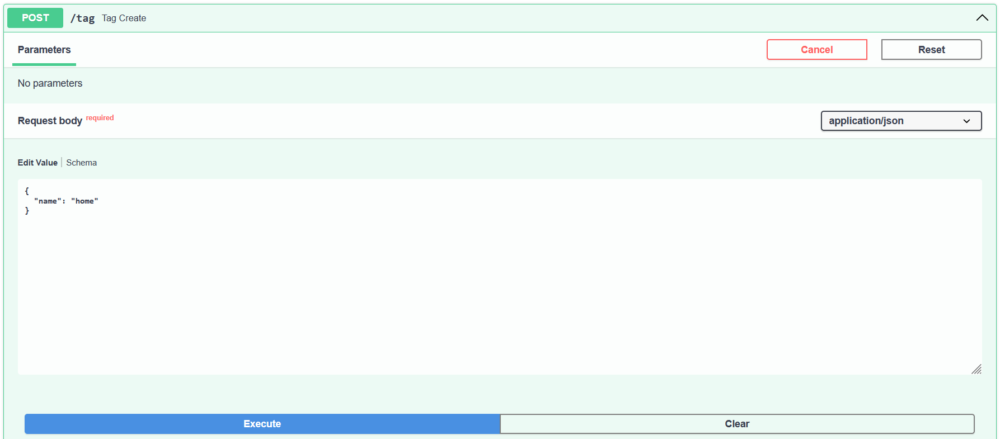
Создаём транзакцию
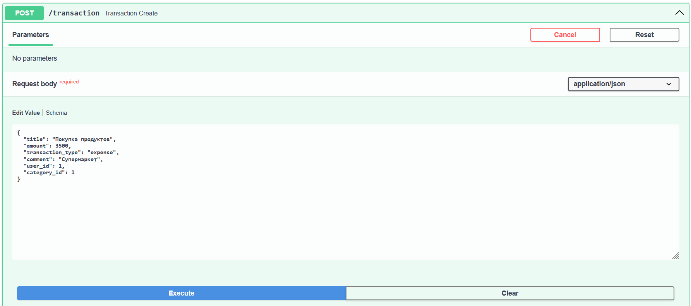
Привязываем транзакцию к тэгу
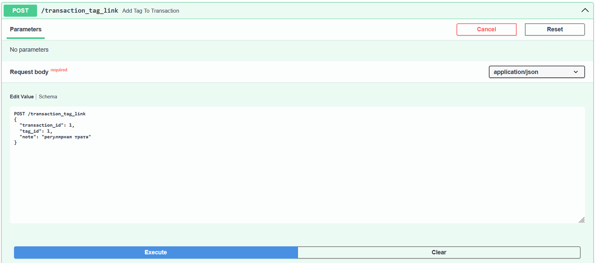
Итоговый json после через get /transaction/{transaction_id}
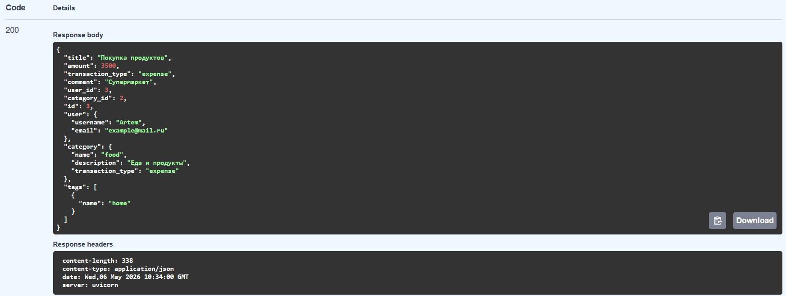

## Результат работы

В результате была реализована работа FastAPI-приложения с PostgreSQL через ORM SQLModel.  
Данные сохраняются не во временной базе, а в реальной базе данных. Также были реализованы связи one-to-many и many-to-many, CRUD-операции и вложенное отображение связанных объектов при получении транзакции.